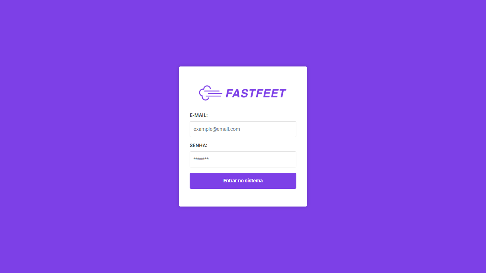
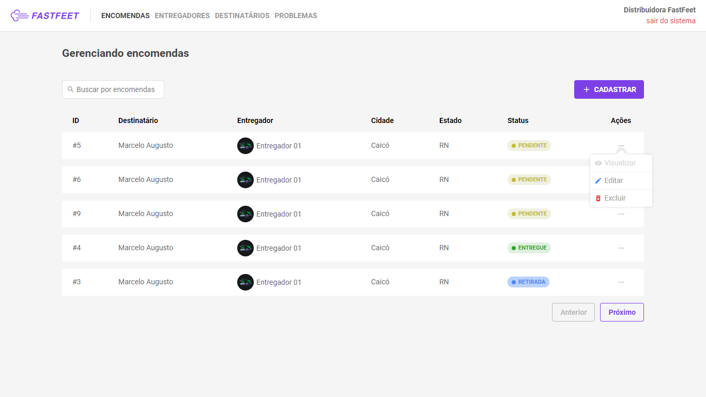
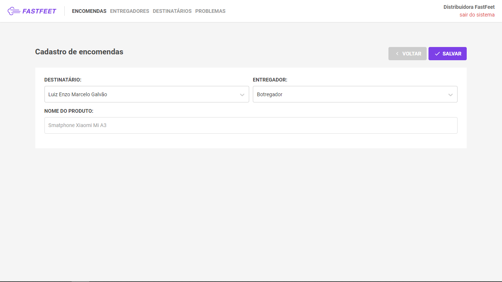
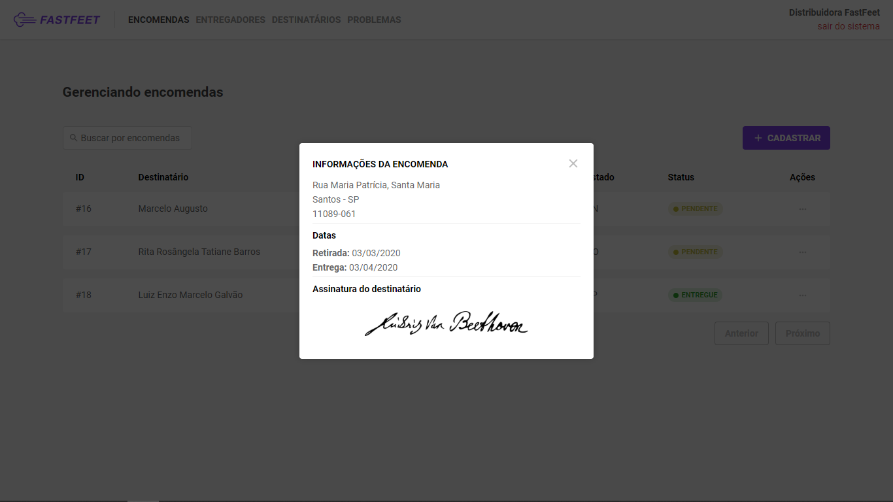
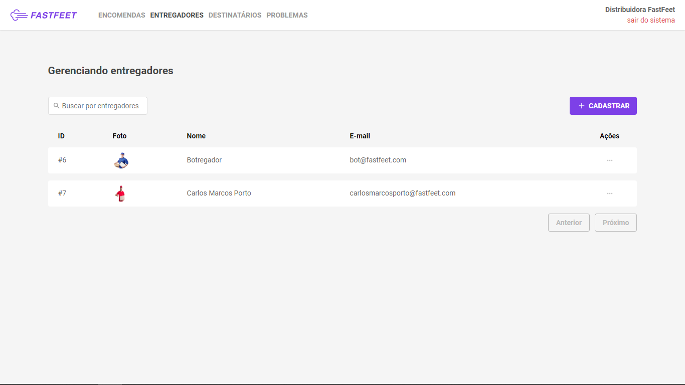
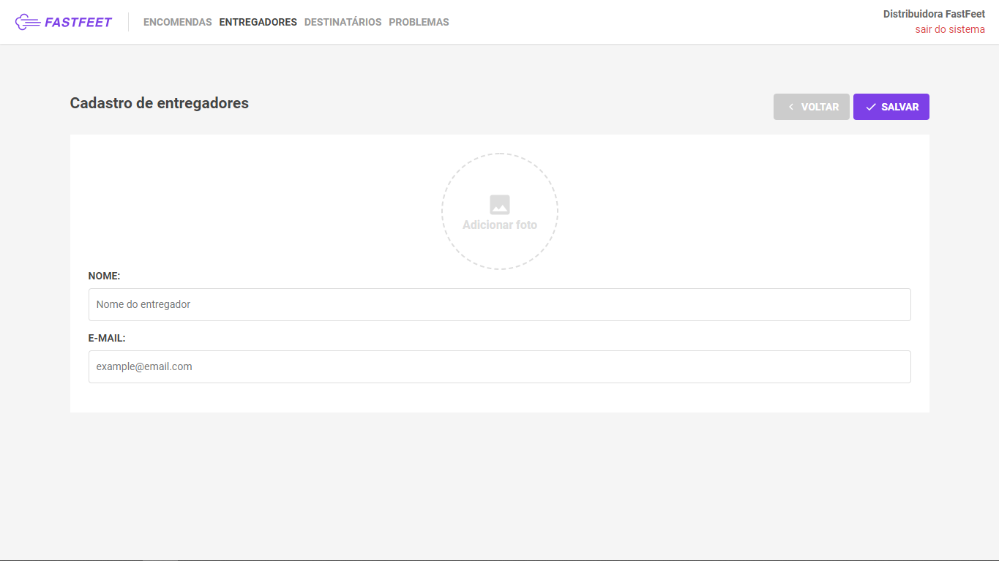
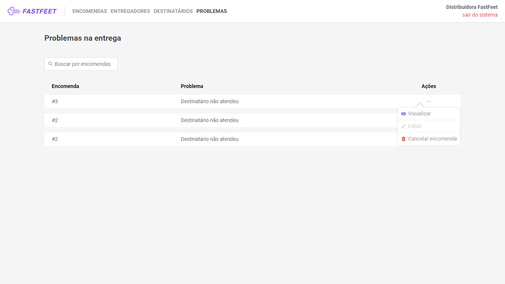
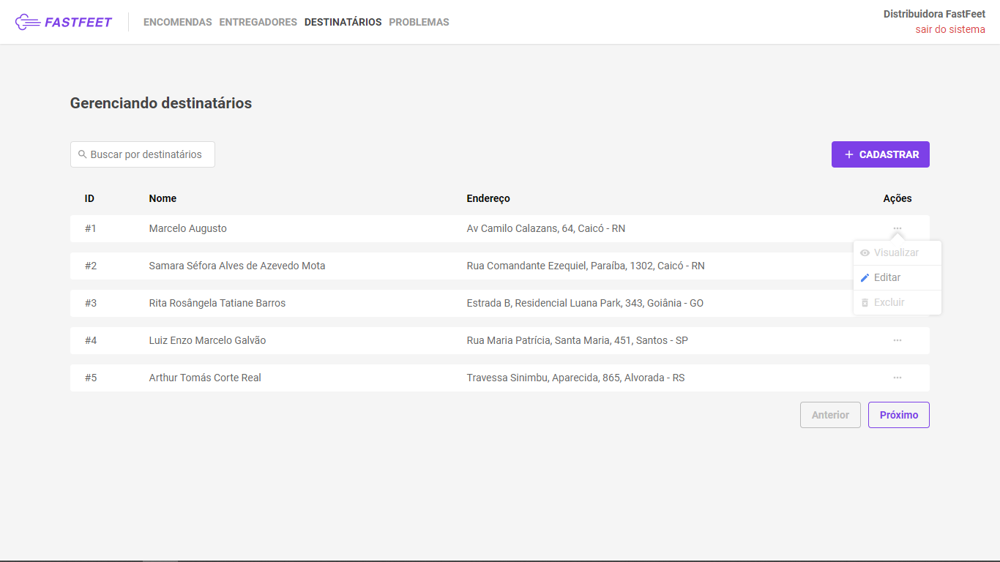
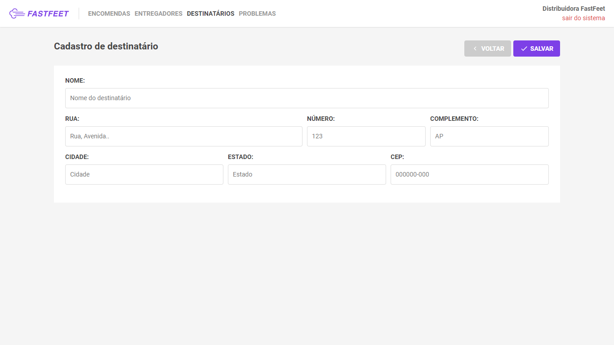
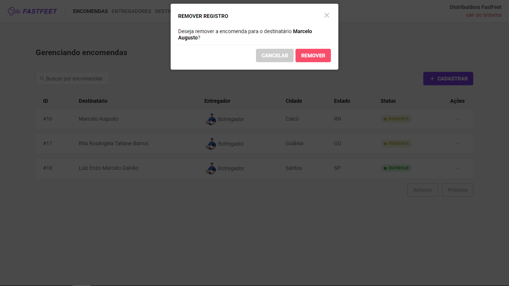

# :boom: FastFeet

FastFeet é uma aplicação desenvolvida para uma transportadora fictícia. Ele permite gerenciar entregadores, destinatários, encomendas, relatar problemas nas entregas dentre outras funcionalidades. Além disso, realiza envio de e-mails para encomendas prontas para serem retiradas ou canceladas.

Você pode consultar a <a href="./backend/docs.md" rel="noopener noreferrer">documentação</a> do backend e verificar informações sobre os <i>endpoints</i>.

## :star: Funcionalidades

- Cadastro de Administradores
- Cadastro de Entregadores
 - *Retirada e Confirmação de entregas*
 - *Upload e Delete de arquivos*
- Cadastro de Encomendas
 - *Encomendas só podem ser retiradas entre 8h e 18h*
 - *Cada entregador pode retirar até 5 encomendas por dia*
- Cadastro de Problema nas entregas
- Cancelamento de Entregas

## :gear: Tecnologias

 - ReactJS
 - Node.js
 - Postgres
 - Sequelize
 - Styled-Components
 - Redux/Sagas
 - React Native
 - React Native Camera
 - AsyncStorage

## :computer: Instruções para o backend

Você precisará ter instalado na sua máquina o **Node.js**, o **Yarn** e o **Docker**. Feitas as configurações, seguem os passos para executar o backend da aplicação:

 - Executar o comando `yarn` para fazer o dowload de todas as dependências necessárias para executar o projeto;

 - Iremos instalar duas imagens de dois bancos de dados: Postgres, para armazenar nossas tabelas; e o Redis, um banco extremamente performático, que será utilizado para envio de e-mails com filas. Abaixo, seguem os respectivos comandos para realizar o download:
    ```
    docker run --name postgres -e POSTGRES_PASSWORD=postgres -p 5432:5432 -d postgres
    ```
    ```
    docker run --name redis -p 6379:6379 -d -t redis:alpine
    ```
 - Execute `yarn queue` para que a fila de processamento de emails esteja funcionando.

 - Execute as `migrations` para que as tabelas sejam criadas:
   ```
   yarn sequelize db:migrate
   ```

 - Se quiser, também pode gerar alguns dados, como usuário administrador e planos, executando os `seeds`:
   ```
   yarn sequelize db:seed:all
   ```
   *Com isso, você terá um usuário administrador com email admin@fastfeet.com e a senha 123456 para fazer autenticação.*

 - Após isso, execute `yarn dev` para que o backend esteja funcionando.

## :computer: Instruções para o frontend

 - Executar o comando `yarn` para fazer o download de todas as dependências necessárias para executar o projeto;

 - Feitos os downloads de todas as dependências, execute `yarn start` para inicilizar o frontend da aplicação;

## :iphone: Instruções para o mobile
 > O projeto teve seu desenvolvimento focado em dispositivos ANDROID.
 
 - Executar o comando `yarn` para fazer o download de todas as dependências necessárias para executar o projeto;

 - Feitos os downloads de todas as dependências, execute `yarn android`, caso seja a primeira execução, ou `yarn start` para inicilizar o aplicativo;

## :camera: Interfaces da aplicação
 > Página de Login

 

 > Página de listagem de encomendas

 

 > Página de criação/edição de entrega

 

 > Modal de visualização de encomenda

 

 > Página de listagem de entregadores

 

 > Página de criação/edição de entregador

 

 > Página de listagem de problemas

 

 > Página de listagem de destinatários

 

 > Página de criação/edição de destinatário

 

 > Modal para confirmação de remoção de registro

 
